# Git
- 다운로드 하기 ([클릭](https://git-scm.com/downloads))

- 설치하기 : 전부다 NEXT를 눌러 기본값으로 설치해준다.

## Github
- 회원가입 하기 ([클릭](https://github.com/))
<br/>

- 저장소 만들기<br/>
Github 로그인 후<br/>
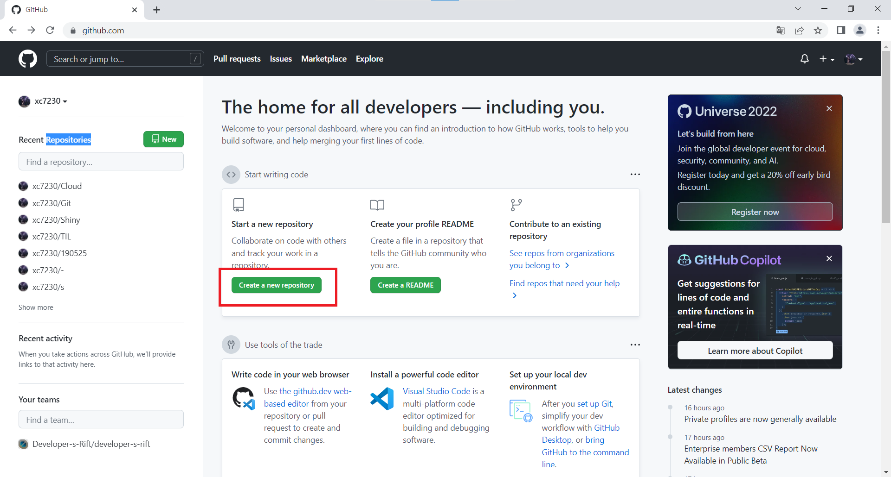<br/>
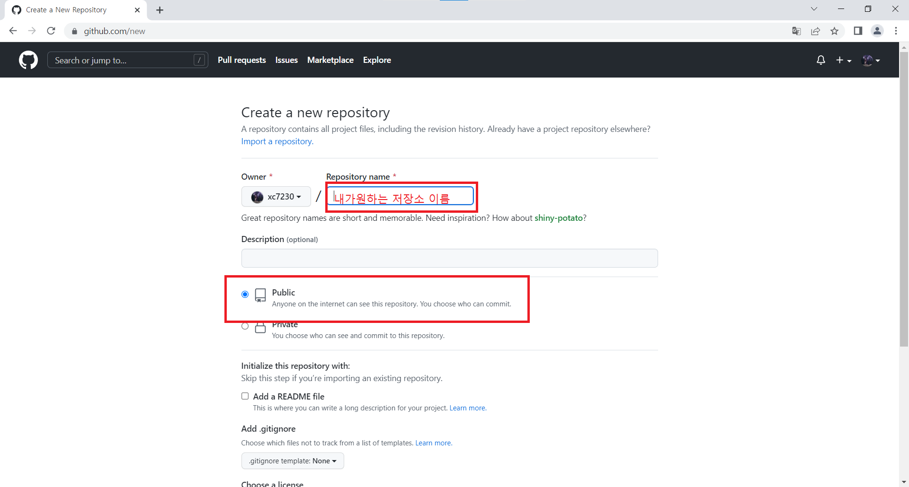<br/>

## 컴퓨터에 Github연결하기
- 내가 원하는 장소에 폴더 만들기<br/>
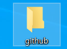<br/>

- 만든 폴더에 저장소 연결하기<br/>
폴더에 들어가서 우클릭 후 `Git Bash Here` 클릭<br/>
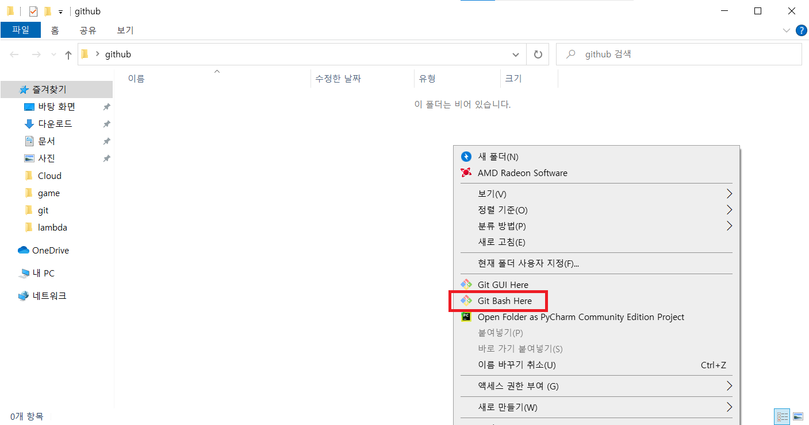<br/>


```shell
git config --global user.name "이름"
git config --global user.email "이메일"
git init
```
- Github에 만들어 놓은 저장소에 들어간 다음 주소 복사
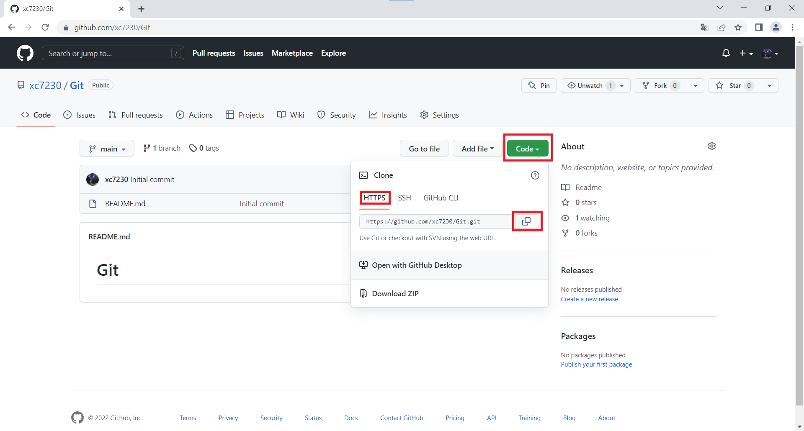<br/>

``` shell
git remote add origin [방금 저장한 저장소의 주소]
git remote -v # 저장됐는지 확인

# 저장소 불러오기
git clone [방금 저장한 저장소의 주소]
cd [저장소 이름] 
```
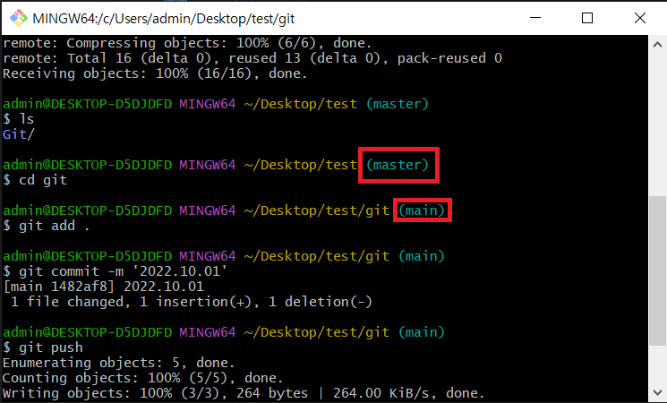<br/>
다음과 같이 master -> main이면 성공이다.<br/>

## 저장소 업로드<br/>
설정이 모두 끝났으면 내 컴퓨터에 있는 여러 파일들을 올려본다.
- ex) 메모장 텍스트 파일 올려보기
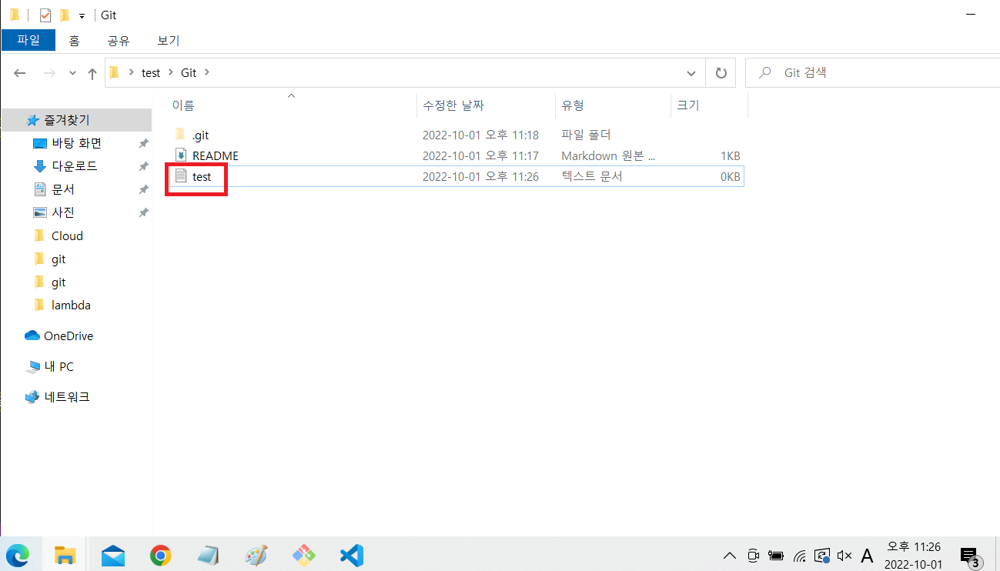<br/>
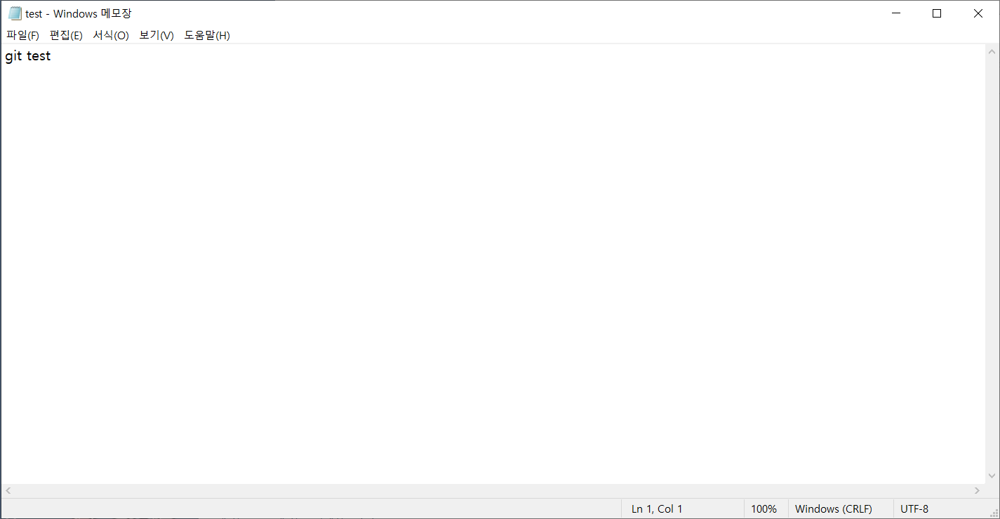<br/>
테스트용 메모장에 아무 내용을 입력한 뒤 저장을 한다.<br/>
```shell
git add .
git commit -m '커밋 메세지 작성' #나는 주로 업로드한 날짜를 적는다.
git push
```
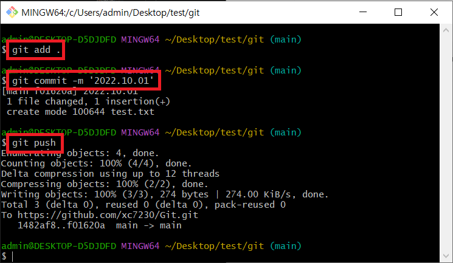<br/>

- 확인<br/>
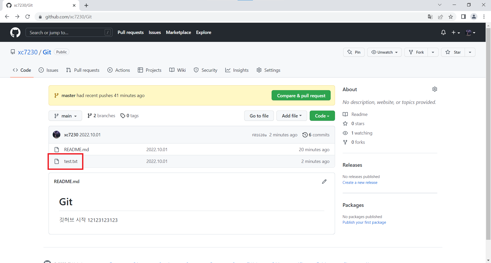<br/>
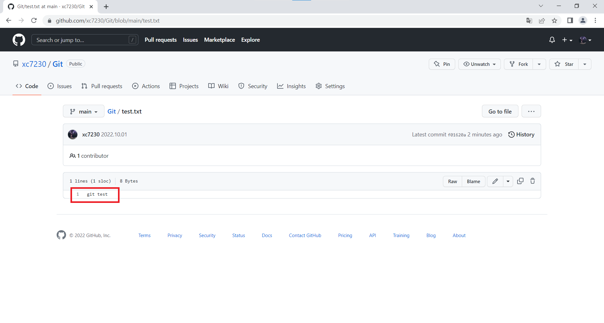<br/>
방금 테스트로 만든 텍스트 파일이 올라온걸 확인 할 수 있다.<br/>
여기까지 성공했으면 Github에서 주로 쓰이는 md파일을 작성하여 그동안 공부했던 내용을 정리해서 업로드 하면 된다.<br/>

- md파일 예시<br/>
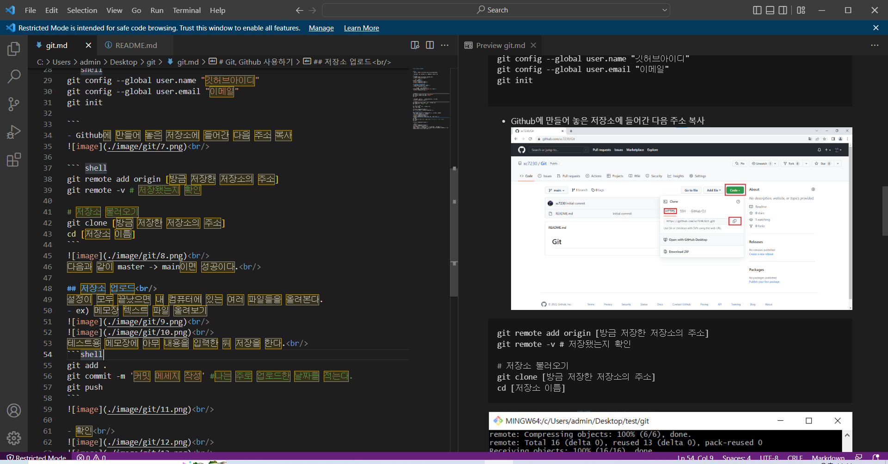<br/>
MarkDown 하러가기 ([클릭](https://github.com/xc7230/Git/blob/main/markdown.md))


## 내가 원하는 폴더만 git에서 가져오기
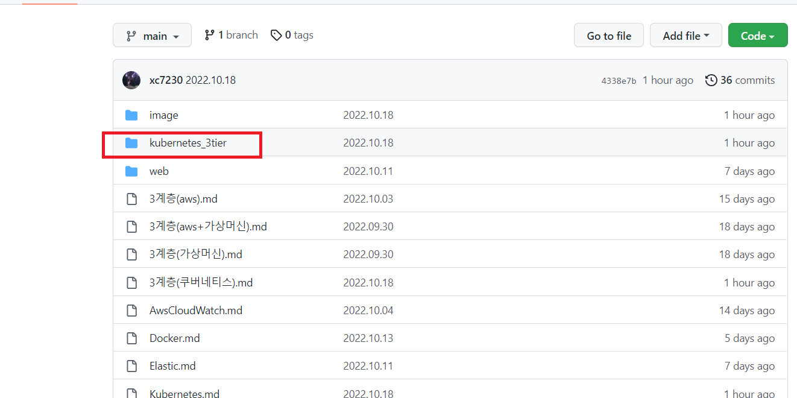<br/>
깃헙에서 특정 디렉토리만 가져오고 싶을 때가 있다. 그때 쓰는 방법을 알아보자
```shell
mkdir test  #깃허브 디렉토리를 받을 디렉토리 생성
cd test 
git init
git remote add -f origin https://github.com/xc7230/Cloud.git    #리모트 폴더 지정
git config core.sparseCheckout true # 일부 체크아웃 기능 활성화
echo kubernetes_3tier/ >.git/info/sparse-checkout   # 받고 싶은 폴더 지정
git pull origin main    # 받기
ls  # 확인 디렉토리가 들어왔는지 확인한다.
```
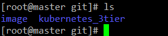<br/>
성공적으로 들어왔다. 그런데 같은 이름의 이미지 폴더까지 같이 가져왔다.<br/>

