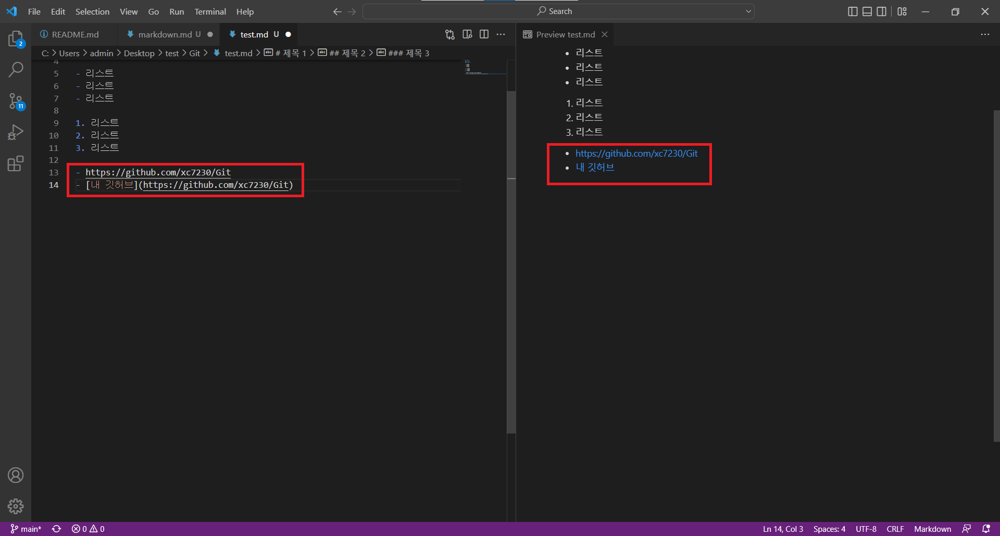

# MarkDown(MD)
Github 서비스에서 동작하는 텍스트 기반의 마크업언어.<br/>

## 편집기 다운로드
1. typora(유료)<br/>
예전에는 무료였는데 지금은 유로로 전환됐다. 마크다운 파일을 작성할때 제일 편한 편집기라고 생각한다.<br/>
다운로드 하기 ([클릭](https://typora.io/))

2. VSCode(무료)<br/>
마이크로 소프트에서 개발한 텍스트 에디터. 확장성이 좋아 여러 종류의 코드를 작성할때 쓰인다.<br/>
다운로드 하기 ([클릭](https://code.visualstudio.com/download))

## VSCode 설정하기
- vscode를 다운 받고 기본 설정으로 설치해준다.<br/>
- vscode를 실행시켜둔 뒤, 마켓플레이스에서 ‘Markdown All in One’플러그인을 설치한다. 
<br/>

## MD파일 생성하기
<br/>
<br/>
다음과 같이 내가 원하는 제목.md로 입력하고 엔터를 쳐서 깃허브와 연동돼 있는 디렉토리에 생성해준다.<br/>

## MD파일 작성하기(예시)

### 미리보기 활성화
만든 MD파일을 실행한 다음<br/>
<br/>
표시된 곳을 클릭하면<br/>
<br/>
또 다른 화면이 생성되고 마크다운 문법을 입력하면 오른쪽 화면에 마크다운 문법이 적용된 상태로 출력해주는걸 확인 할 수 있다.<br/>
<br/>

### 마크다운 문법
- 제목<br/> 
`# 제목`<br/>
`## 제목`<br/>
`### 제목`<br/>
<br/>

- 순서 없는 목록<br/>
`- 리스트`<br/>
`- 리스트`<br/>
`- 리스트`<br/>
<br/>

- 순서 있는 목록<br/>
`1. 리스트`<br/>
`2. 리스트`<br/>
`3. 리스트`<br/>
<br/>

- 링크<br/>
`주소`
`[타이틀](주소)`
<br/>

- 코드 입력<br>
` ```사용하는 언어 `<br/>
` 코드 `<br/>
` ``` `<br/>
<br/>

- 이미지<br/>
<br/>
<br/>
나같은 경우 md파일을 생성한 디렉토리에 image 디렉토리를 하나 생성하고, 그 안에 개별 md파일에 사용할 디렉토리를 하나 더 생성했다.<br/>
<br/>
그리고 테스트용 이미지 파일 하나를 집어 넣는다.<br/>
`  `<br/>
`  `
<br/>
이렇게 상대경로로 설정해야 나중에 Github에 업로드 할때 깨지지 않는다.<br/>

- 줄바꿈 <br/>
` 줄바꾸기<br/> `
` 줄바꾸기<br/> `
` 줄바꾸기<br/> `<br/>
<br/>
마크다운 언어는 엔터를 쳐도 결과물에서는 줄바꾸기가 되지 않는다. 반드시 줄을 바꾸고 싶을때는 뒤에 `<br/>`을 붙여야 한다.<br/>